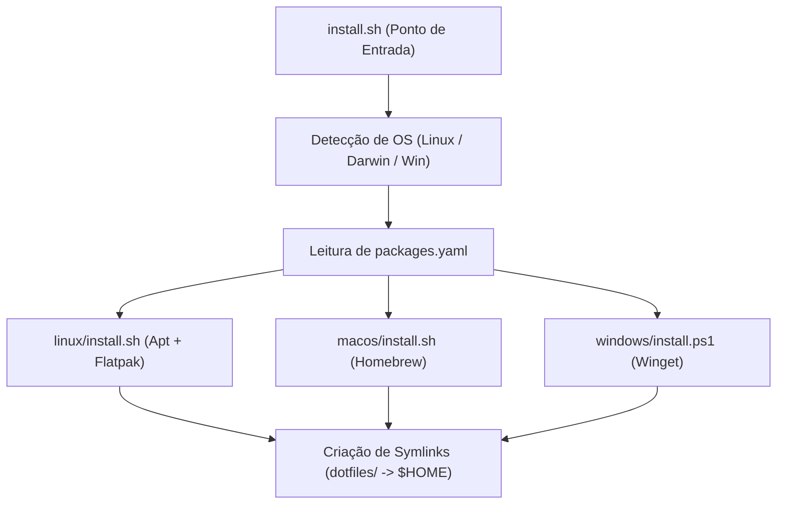

# DESIGN — Meu Setup Architecture & Design Rules

## 1. Arquitetura de Provisionamento

---

## 2. Princípios de Design

1. **Declaratividade:**
   - Softwares e extensões devem ser listados em `packages.yaml` antes de serem instalados manualmente.
2. **Não Destrutividade:**
   - Caso um dotfile já exista no destino, deve ser realizado backup automático (`.bak`) antes da substituição por symlink.
